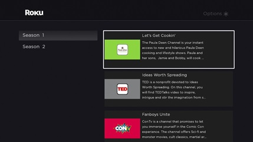

# SGDEX Guide: EpisodePickerView

The starting point for this guide is the source code in this folder.

## Creating the EpisodePickerView

First, create the file EpisodePickerLogic.brs. In this file we need to:

*	create node CategoryListView
*	set its content and a fields
*	configure�observing fields
*	then calling show and returning the object.

It should look like below:

```
function ShowEpisodePickerView()
    episodePicker = CreateObject("roSGNode", "CategoryListView")
    episodePicker.posterShape = "16x9"
    content = CreateObject("roSGNode", "ContentNode")

    content.addfields({
        HandlerConfigCategoryList: {
            name: "SeasonsHandler"
            fields: {
                seasons: seasonContent
            }
        }
    })

    episodePicker.content = content
    episodePicker.ObserveField("selectedItem", "OnEpisodeSelected")

    ' this will trigger job to show this view
    m.top.ComponentController.callFunc("show", {
        view: episodePicker
    })

    return episodePicker
end function
```

## Creating the SeasonsHandler

Now, you will see that we are creating a second content handler.

This is required as we need to set _contentType: "section"_ to categories.

Now create SeasonsHandler.xml and SeasonsHandler.brs in the content folder.

The component should extend ContentHandler and contain an interface which contains the field "seasons" which is an array. This may be different depending on how you got your information from GridHandler. It should look like the file below.

```
<?xml version="1.0" encoding="UTF-8"?>
<component name="SeasonsHandler" extends="ContentHandler" xsi:noNamespaceSchemaLocation="https://devtools.web.roku.com/schema/RokuSceneGraph.xsd">
    <interface>
        <field id="seasons" type="array" />
    </interface>
    <script type="text/brightscript" uri="pkg:/components/content/SeasonsHandler.brs" />     
</component>
```

In SeasonsHandler.brs you need to override GetContent() function from ContentHandler().  In this function we get our seasons that we passed in, go through them and organize it and append it to m.top.content, along with getting appropriate season information for the right panel.

Ours looks like this after we are done, but again it will differ depending on your GridHandler.brs.

```
sub GetContent()
    seasons = m.top.HandlerConfig.Lookup("seasons")
    rootChildren = []
    seasonNumber = 1
    for each season in seasons
        children = []
        for each episode in season
            children.Push(episode)
        end for

        seasonNode = CreateObject("roSGNode", "ContentNode")
        strSeasonNumber = StrI(seasonNumber)
        seasonNode.SetFields({
            title: "Season " + strSeasonNumber
            contentType : "section"
       })
       seasonNumber = seasonNumber + 1
       seasonNode.AppendChildren(children)
       rootChildren.Push(seasonNode)
    end for
    m.top.content.AppendChildren(rootChildren)
end sub
```

## Adding item clicked functionality

Now we can move onto the EpisodePickerLogic.brs file. We need to create the function OnEpisodeSelected() that we observed earlier. In this we get the categoryList, get the item, then launch the DetailsView.

It should look like this:

```
sub OnEpisodeSelected(event as Object)
    ' show details view with selected episode content
    categoryList = event.GetRoSGNode()
    itemSelected = event.GetData()
    category = categoryList.content.GetChild(itemSelected[0])
    ShowDetailsView(category.GetChild(itemSelected[1]), 0, false)
end sub
```

And after that you should be able to click on "episodes" and be greeted with this View:



###### Copyright (c) 2018 Roku, Inc. All rights reserved.
